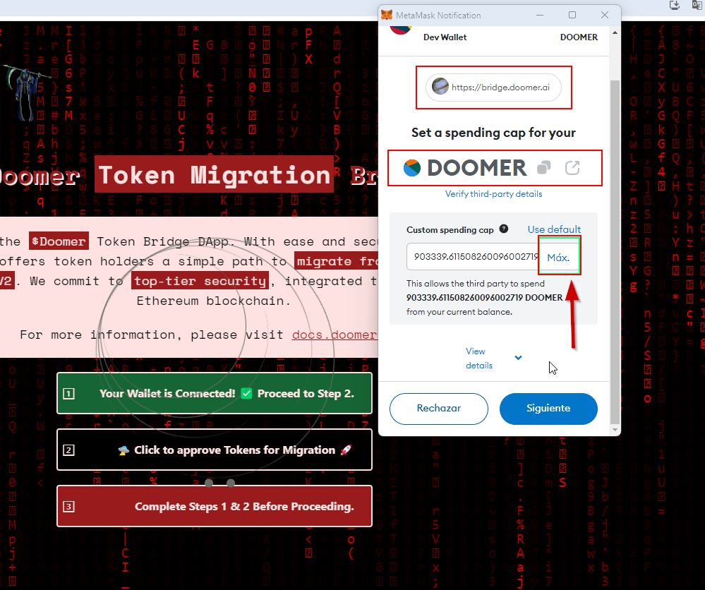

# Doomer Bridge Migration 

## FAQ

### Why should I use this Bridge?

This Bridge is designed to provide you with a seamless and user-friendly experience. The entire process consists of just three easy steps: connect your wallet, approve your tokens, and migrate your tokens. This process directly exchanges your old tokens for new ones without any wait time or additional steps.

### What does Step 2 entail?

In technical terms, Step 2 involves calling the approval function of $doomer v1 and giving permission to the Bridge Smart Contract to manage your tokens. In simpler terms, Step 2 is where you authorize the Bridge Smart Contract to handle your $doomer v1 tokens in preparation for Step 3 (TradeInToken).

### What happens in Step 3?

In Step 3, the Bridge Smart Contract's "TradeInToken" function is invoked. During this process, your tokens are sent to the Bridge Smart Contract. The Bridge Smart Contract then manages the Doomer V1 tokens for the liquidity wallet (AskDoomer.eth), and you immediately receive your new tokens.

### Does the DApp have access to any of my tokens?

The DApp only requests to manage your $Doomer tokens on your behalf using the Bridge Smart Contract during Step 2. It does not access any of your other tokens.

### Does the DApp have access to my private keys?

No, the Bridge does not have access to your private keys.

### Why does Step 3 fail due to a gas error?

This usually happens if you have not approved all your Doomer tokens in Step 2. Make sure you approve all your Doomer tokens during Step 2 to prevent this error and ensure a successful transaction.

# Bridge Migration 

We have introduced a new smart contract for the Doomer token:

**New Doomer Token Smart Contract:**
\`\`\`
0xc51043a39decddd17dde1a0c756d96b103e140a5
\`\`\`
You can click [here](https://etherscan.io/token/0xc51043a39decddd17dde1a0c756d96b103e140a5) to view the new $doomer token on Etherscan.

We have also deployed a Bridge smart contract for the migration:

**Bridge Smart Contract Address:**
\`\`\`
0xaeb06836ac38e548ffafa57c95243696552e3a15
\`\`\`
You can click [here](https://etherscan.io/address/0xaeb06836ac38e548ffafa57c95243696552e3a15) to view the Bridge Smart Contract on Etherscan.